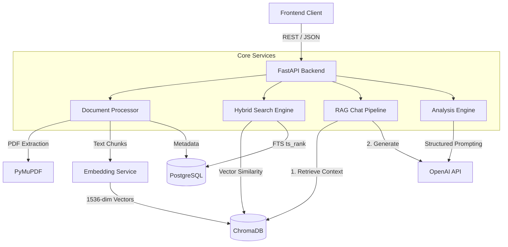

# Lexora

A legal document analysis platform that automates contract review, risk classification, and obligation tracking. It leverages hybrid search, vector embeddings, and retrieval-augmented generation (RAG) to process complex legal agreements.

## Problem Statement

Legal teams process hundreds of complex agreements, but manual review is error-prone and scales poorly. Identifying conflicting clauses across multiple contracts, tracking disparate obligations, and extracting entity relationships require significant human capital. Traditional keyword search is insufficient for the semantic nuances of legal text, often failing to retrieve relevant context when exact terminology differs.

## Solution

Lexora digitizes the contract review lifecycle by acting as an intelligent processing layer. It parses multi-page PDFs, chunks text with semantic overlap, generates vector embeddings, and provides a RAG-powered query interface. It automates cross-document comparison and extracts knowledge graphs representing contractual obligations and liabilities, transforming unstructured documents into queryable data structures.

## Key Features

* **Retrieval-Augmented Generation (RAG)**: Context-aware document querying with exact chunk citations, page mapping, and vector relevance scoring.
* **Hybrid Search Engine**: Combines PostgreSQL full-text search (`ts_rank`) with ChromaDB semantic vector similarity for comprehensive retrieval across the document corpus.
* **Document Processing Pipeline**: Asynchronous extraction and chunking using a sliding window algorithm (1500 words with 200-word overlap) to preserve clause context.
* **Risk Classification Engine**: Multi-dimensional scoring mechanism analyzing liability, termination, compliance, and payment vectors to flag critical issues.
* **Entity Knowledge Graph**: Force-directed extraction and mapping of contractual entities, parties, and their legal relationships.
* **Cross-Document Comparison**: Automated diffing of clauses to detect conflicts, identify missing terms, and surface divergent obligations.

## Platform Interface

### 1. Intelligence Dashboard
The central command center providing a high-level overview of the entire document corpus. It features a real-time risk gauge, statistical distribution of flagged anomalies, processing pipeline status, and an index of recently ingested documents.


### 2. Analysis Workspace
A dedicated environment for structured document processing. Select any ingested PDF to run the 10-point analysis engine, which extracts executive summaries, key clauses, payment terms, and critical missing clauses, presented in a structured JSON-driven UI.


### 3. Risk Assessment Dashboard
An automated risk classification view that parses the active document against liability, IP, and compliance vectors. Identifies specific clauses, assigns severity scores, explains the risk, and provides mitigation recommendations.


### 4. Obligation Tracker
Extracts and classifies contractual obligations by party, deadline, and frequency. Includes filtering by priority and obligation type, allowing legal teams to track compliance requirements across hundreds of pages.


### 5. Document Comparison
A cross-document analysis tool that diffs two selected contracts. It calculates an alignment score, detects conflicting clauses with side-by-side highlighting, flags missing terms, and identifies divergent definitions.


### 6. Knowledge Graph
A force-directed network visualization of the legal entities, parties, and obligations extracted from the active document. Useful for mapping complex corporate structures and multi-party liability chains.


### 7. Research Console
A RAG-powered interactive query interface. Users can ask natural language questions about the active document. The system retrieves relevant vectors from ChromaDB and generates answers with exact source chunk citations and relevance scores.

## Architecture



## System Design

* **Frontend**: Built with Next.js 15 using the App Router. Relies on TanStack Query for data fetching, caching, and server-state synchronization. Uses a component-driven architecture with Tailwind CSS and `shadcn/ui` for a strict design system.
* **Backend**: FastAPI framework enabling asynchronous request handling. Designed using domain-driven principles, separating route controllers from core business logic services (`pdf_service`, `embedding_service`, `analysis_service`).
* **Database**: PostgreSQL (accessed via `asyncpg` and SQLAlchemy ORM) serves as the source of truth for relational metadata, user state, upload status, and structured analysis results.
* **AI Pipeline**: Utilizes OpenAI `gpt-4o` with constrained JSON mode to guarantee structured output schemas for analytical processing. Embeddings are generated via `text-embedding-3-small` mapping text to 1536-dimensional vectors.
* **Storage Layer**: Persistent ChromaDB instance handles vector storage, indexing, and $O(log N)$ cosine similarity search. Local file storage manages temporary PDF blob processing.

## Technical Highlights

* **Constrained LLM Generation**: Enforces strict JSON schemas for entity extraction and risk scoring, effectively eliminating parsing errors and enabling deterministic UI rendering from non-deterministic models.
* **Asynchronous Execution**: Leverages Python's `asyncio` event loop for non-blocking I/O. Network requests to the OpenAI API and heavy database transactions are fully awaited, preventing thread starvation.
* **Citation Tracking Architecture**: RAG queries do not just return text; the pipeline calculates relevance scores and maps generated responses back to specific chunk indices and original document pages to mitigate hallucination risks.
* **Optimized Canvas Rendering**: The frontend implements a custom 2D Canvas rendering engine with a physics simulation loop for the Knowledge Graph, bypassing DOM node bottlenecks and ensuring 60FPS performance even with hundreds of rendered entities.

## Challenges Solved

**Context Loss in Legal Documents**
Standard chunking methods frequently fractured legal clauses, resulting in degraded retrieval quality. This was solved by implementing a token-aware sliding window algorithm with a 200-word overlap. This guarantees that complex legal definitions remain intact within at least one embedded chunk, significantly improving semantic similarity scores during retrieval.

**Hallucination in Automated Review**
LLMs tend to synthesize non-existent terms when summarizing lengthy legal texts. This was addressed by anchoring the generation phase strictly to the retrieved context window and forcing the model to cite its sources. The application then cross-references these citations against the retrieved chunks before presenting them to the user.

**Hybrid Search Resolution**
Keyword searches failed on synonyms, while semantic searches occasionally missed exact identifier matches (e.g., specific statute numbers). Solved by implementing a hybrid approach: querying both PostgreSQL's `to_tsvector` and ChromaDB's cosine similarity, then exposing both mechanisms to the client depending on query intent.

## Tech Stack

**Frontend**
* Next.js 15, React 19
* TypeScript
* Tailwind CSS v4
* TanStack React Query

**Backend**
* Python 3.12, FastAPI
* SQLAlchemy (Async), asyncpg
* PyMuPDF (PyData)

**AI & Infrastructure**
* OpenAI API (GPT-4o, text-embedding-3-small)
* PostgreSQL
* ChromaDB
* Docker & Docker Compose

## API Design

| Method | Endpoint | Description |
|--------|----------|-------------|
| `POST` | `/api/documents/upload` | Ingests PDF, chunks text, and generates vector embeddings. |
| `GET`  | `/api/documents/{id}` | Retrieves document metadata and pagination boundaries. |
| `POST` | `/api/analysis/{id}` | Triggers async pipeline for risk, clause, and obligation extraction. |
| `POST` | `/api/chat` | Executes a RAG query against the document's vector subspace. |
| `POST` | `/api/search` | Performs a global hybrid search across the entire document corpus. |
| `POST` | `/api/compare/documents` | Calculates document divergence and conflict mapping. |

## Installation

1. **Clone the repository**
```bash
git clone https://github.com/username/lexora.git
cd lexora
```

2. **Configure Environment**
```bash
# Backend
cp backend/.env.example backend/.env
# Add DATABASE_URL and OPENAI_API_KEY

# Frontend
echo "NEXT_PUBLIC_API_URL=http://localhost:8000" > frontend/.env.local
```

3. **Start Services via Docker**
```bash
docker compose up -d postgres
```

4. **Initialize Backend**
```bash
cd backend
python -m venv venv
source venv/bin/activate
pip install -r requirements.txt
uvicorn app.main:app --reload --port 8000
```

5. **Initialize Frontend**
```bash
cd frontend
npm install
npm run dev
```

## Deployment

* **Frontend**: Deployed to Vercel via Git integration.
* **Backend**: Containerized and deployed to Render as a Web Service.
* **Database**: Managed PostgreSQL instance hosted on Neon.
* **Vector Store**: ChromaDB configured with persistent disk volumes mounted to the container runtime.

## Future Improvements

* **Streaming RAG Responses**: Implement Server-Sent Events (SSE) in the FastAPI chat endpoints to stream generated tokens to the client, improving perceived latency.
* **Distributed Task Queue**: Migrate the synchronous document processing pipeline to a Celery worker pool backed by Redis for horizontal scalability during mass-upload events.
* **HNSW Index Optimization**: Tune ChromaDB's underlying HNSW index parameters (`M`, `efConstruction`) to maintain sub-100ms retrieval latency as the vector space scales beyond 1,000,000 embeddings.

## Project Impact

Lexora transforms the legal review process from a linear, manual task into a highly parallel, queryable operation. By surfacing buried high-risk clauses, conflicting obligations, and exact textual citations, it mitigates legal exposure and drastically reduces the engineering overhead required to parse unstructured legal data.
