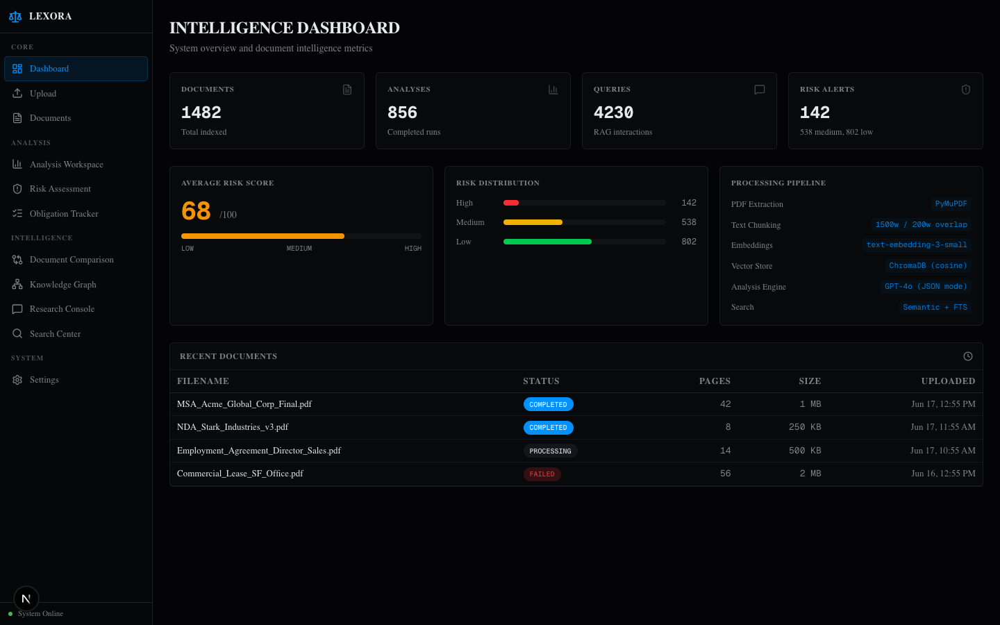
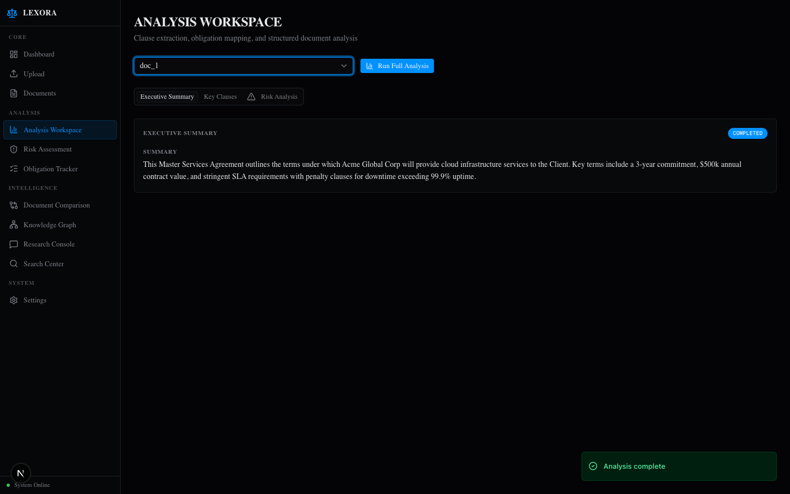
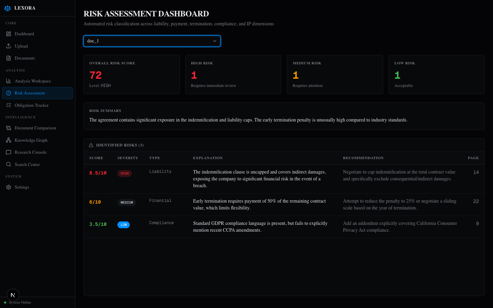
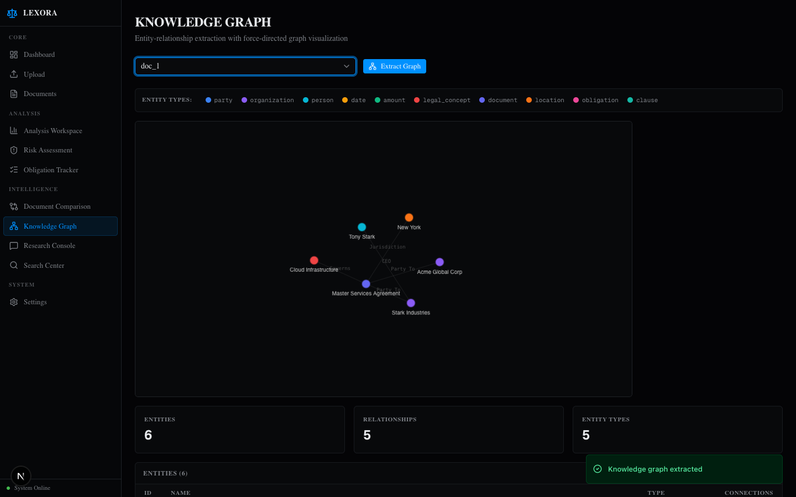
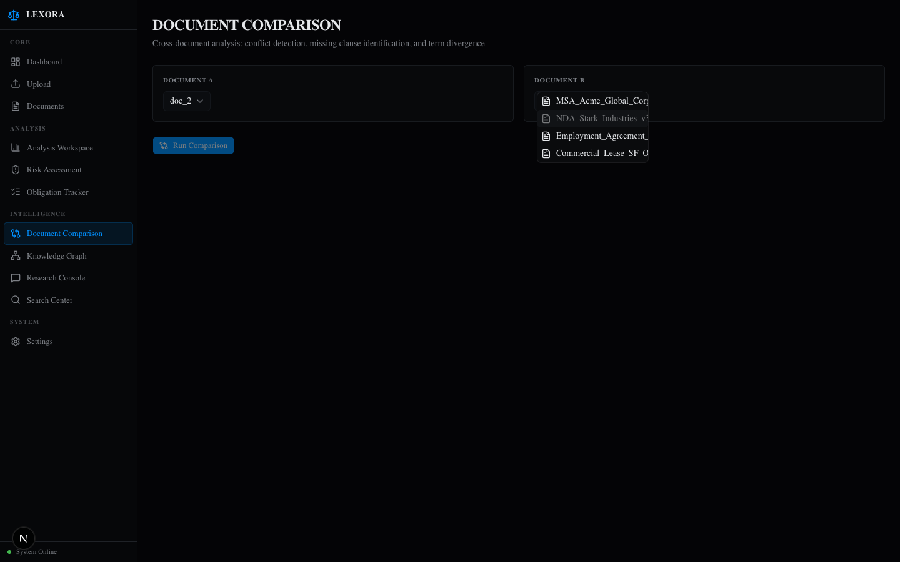
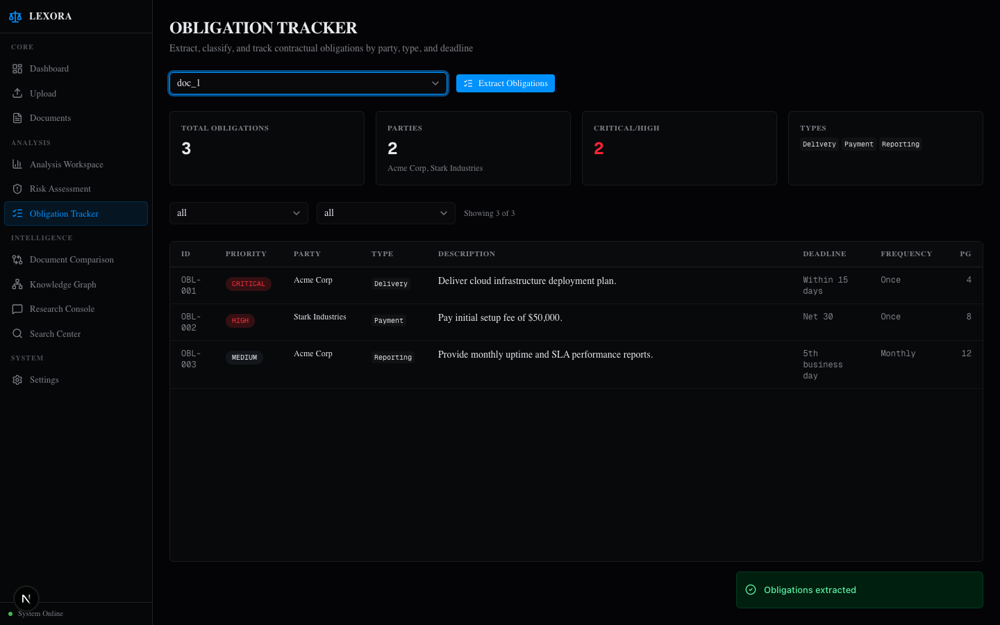
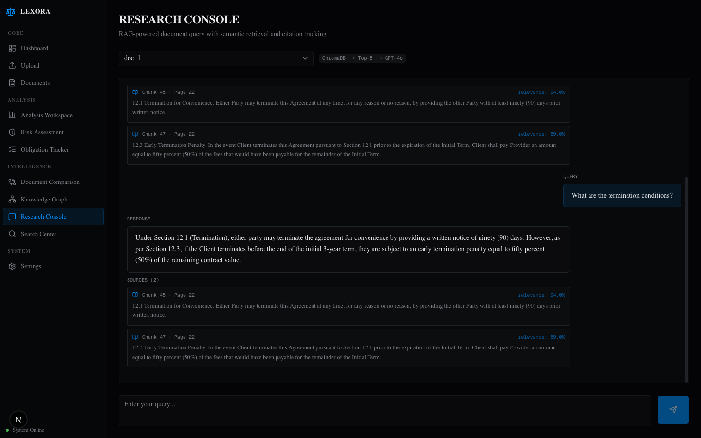
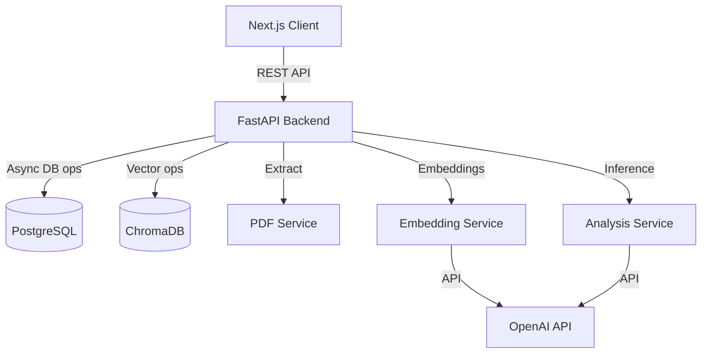

# Lexora

Nexus is an AI-powered legal document analysis platform designed to automate contract review and risk assessment. It leverages Retrieval-Augmented Generation (RAG) and semantic vector search to allow users to instantly extract obligations, classify risks, and query large legal repositories with high precision.

## Problem Statement

Legal professionals spend thousands of hours manually reviewing contracts, parsing complex clauses, and identifying compliance risks. Traditional document management systems lack semantic understanding, forcing teams to rely on keyword searches and manual cross-referencing to find critical obligations, which is both time-consuming and prone to human error.

## Solution

Nexus solves this by transforming static documents into intelligent, queryable knowledge bases. By utilizing advanced natural language processing and vector embeddings, the platform can semantically understand legal text, programmatically identify areas of concern, and synthesize accurate answers based strictly on the source material.

## Platform Preview

| Dashboard | Document Analysis |
|:---:|:---:|
|  |  |

| Risk Assessment | Knowledge Graph |
|:---:|:---:|
|  |  |

| Document Comparison | Obligation Extraction |
|:---:|:---:|
|  |  |

| Research Console |
|:---:|
|  |

## Key Features

- **Retrieval-Augmented Generation (RAG)**: Context-aware query system that grounds LLM responses in specific document clauses, minimizing hallucination.
- **Semantic Search & Vector Embeddings**: Utilizes OpenAI embedding models and ChromaDB to perform high-dimensional similarity searches across legal text.
- **Document Processing Pipeline**: Asynchronous ingestion engine using PyMuPDF for robust PDF parsing, intelligent chunking, and pagination tracking.
- **Risk Classification Engine**: Automated extraction and categorization of legal risks (High, Medium, Low) with structured JSON outputs.
- **Obligation Extraction**: Programmatic identification of contractual duties, deadlines, and compliance requirements.
- **Cross-Document Comparison**: Algorithmic diffing and semantic comparison of legal documents to highlight critical changes and discrepancies.

## Architecture



## System Design

- **Frontend**: Next.js 15 (App Router), React 19, and TailwindCSS (v4). UI components are built using Shadcn UI and Radix primitives to ensure accessibility and responsive design. State management and data fetching are handled via React Query.
- **Backend**: Python 3 backend powered by FastAPI and Uvicorn. The architecture follows a service-oriented pattern, separating route handlers, core business logic, and data access layers.
- **Database**: PostgreSQL handles relational data (users, document metadata, chat histories, analysis results) using SQLAlchemy with `asyncpg` for non-blocking I/O.
- **Vector Storage**: ChromaDB acts as the dense vector database, persisting document embeddings locally with hierarchical metadata filtering (`document_id`, `chunk_index`).
- **AI Pipeline**: Built around OpenAI's API. The pipeline involves custom chunking strategies for legal text, embedding generation (`text-embedding-3-small`), and structured data extraction utilizing GPT models.

## Technical Highlights

- **Scalable Async I/O**: The entire backend is built using asynchronous Python. Endpoints leverage `async/await` and asynchronous SQLAlchemy sessions to handle concurrent long-running LLM inferences and database queries without blocking the event loop.
- **Intelligent Chunking Strategy**: Instead of naive character splitting, the pipeline respects page boundaries and word counts, ensuring that semantic context (like multi-line legal clauses) is preserved during embedding.
- **Robust State Management**: Document ingestion is treated as a state machine (`pending` -> `processing` -> `completed` / `failed`), allowing the frontend to poll status and recover from API rate limits gracefully.
- **Schema-Driven Extraction**: AI responses are strongly typed using Pydantic models, forcing the LLM to output predictable JSON structures for risk analysis and obligation extraction.

## Challenges Solved

1. **Context Window Limitations**: Legal documents frequently exceed LLM context windows. This was solved by implementing a custom RAG pipeline that vectorizes document chunks, retrieves the top `k` most relevant sections using cosine similarity, and synthesizes an answer with exact citations.
2. **Hallucination in Legal Contexts**: LLMs can easily fabricate legal precedents. The system mitigates this by strictly grounding the generation process in retrieved context and returning explicit chunk metadata (page numbers, section IDs) for user verification.
3. **Complex PDF Parsing**: Legal PDFs often contain multi-column layouts and scanned text. PyMuPDF was selected and configured to extract raw text accurately while preserving pagination for accurate citations.

## Tech Stack

- **Frontend**: Next.js, React 19, Tailwind CSS, Shadcn UI, React Query
- **Backend**: FastAPI, Python, SQLAlchemy, asyncpg
- **Databases**: PostgreSQL (Relational), ChromaDB (Vector)
- **AI / ML**: OpenAI API (Embeddings & Inference), PyMuPDF
- **Infrastructure**: Docker, Docker Compose

## API Design

- `POST /api/documents/upload` - Multipart file upload, initiates async processing pipeline.
- `GET /api/documents/{id}/status` - Polling endpoint for the ingestion state machine.
- `POST /api/chat/query` - RAG endpoint; accepts a query and document ID, returns AI synthesis and citation metadata.
- `POST /api/analysis/{id}/risk` - Triggers the Risk Classification Engine for a specific document.
- `POST /api/compare` - Takes two document IDs and returns a structured semantic diff.

## Installation

1. Clone the repository:
   ```bash
   git clone https://github.com/Aayushiii25/Lexora-.git
   cd Lexora-
   ```

2. Set up environment variables:
   ```bash
   cp backend/.env.example backend/.env
   # Add your OPENAI_API_KEY to backend/.env
   ```

3. Start the infrastructure using Docker Compose:
   ```bash
   docker-compose up -d postgres backend
   ```

4. Install frontend dependencies and start the development server:
   ```bash
   npm install
   npm run dev
   ```

## Deployment

The backend and PostgreSQL database are containerized using Docker, allowing for seamless deployment to ECS, Kubernetes, or serverless container platforms like Google Cloud Run. The Next.js frontend is optimized for edge deployment on Vercel, utilizing static site generation (SSG) where appropriate and server-side rendering (SSR) for dynamic dashboards. Vector storage is currently persisted on an attached volume and can be migrated to a managed Chroma/Pinecone instance for horizontal scaling.

## Future Improvements

- **Distributed Task Queue**: Migrate document ingestion and analysis tasks to Celery/Redis or Temporal to improve horizontal scaling and retry semantics.
- **Hybrid Search**: Implement BM25 lexical search alongside dense vector embeddings to improve keyword retrieval accuracy for specific legal terms.
- **Streaming Responses**: Implement Server-Sent Events (SSE) for the chat interface to reduce perceived latency during LLM inference.
- **Document OCR Integration**: Integrate Tesseract or AWS Textract to support ingestion of scanned image-based PDFs.

## Project Impact

Nexus significantly reduces the time required for due diligence and contract review. By automating the extraction of key obligations and surfacing hidden risks, it empowers legal teams to process higher volumes of documents with greater accuracy, transforming a manual, error-prone workflow into a streamlined, data-driven operation.
